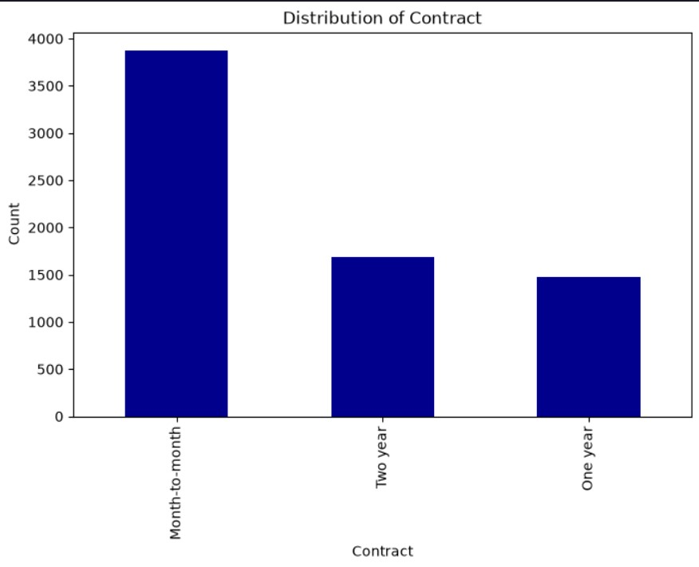
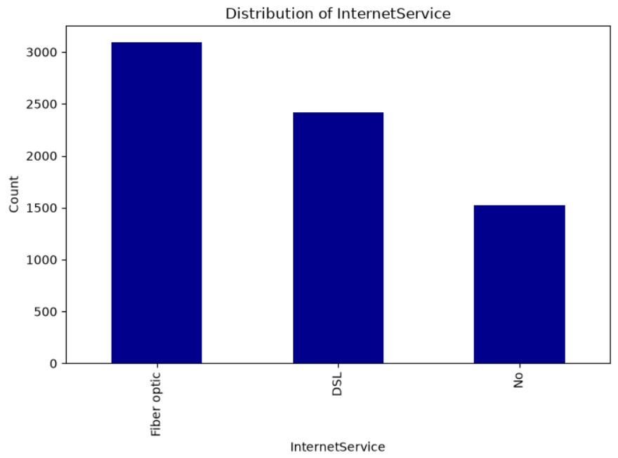
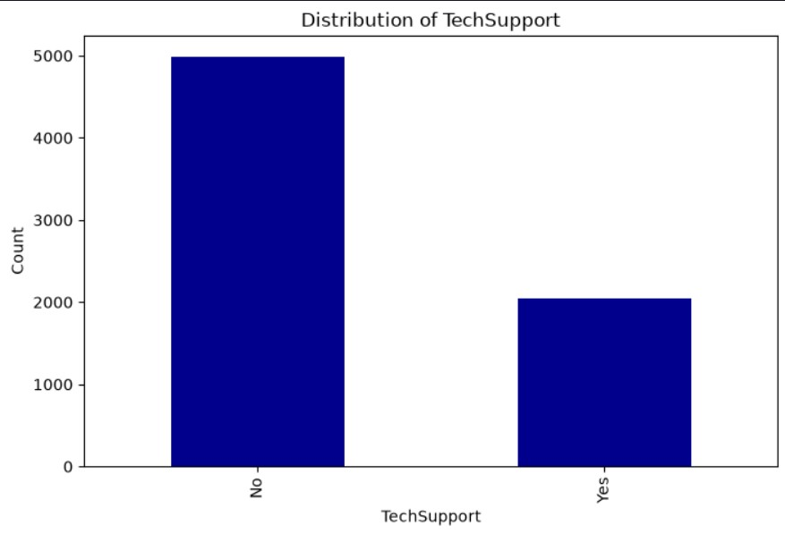
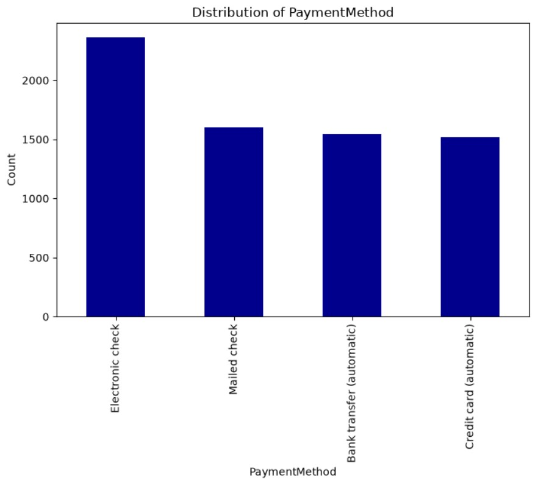
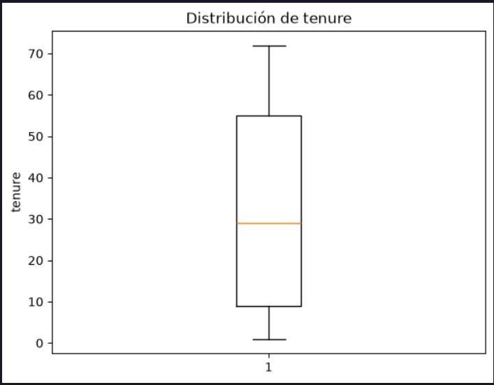
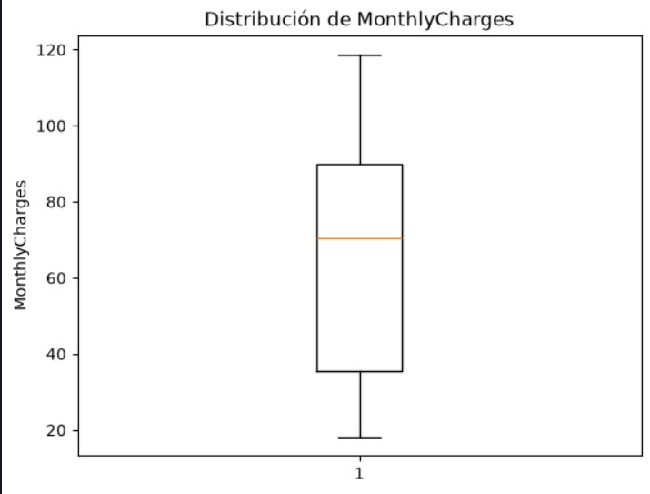
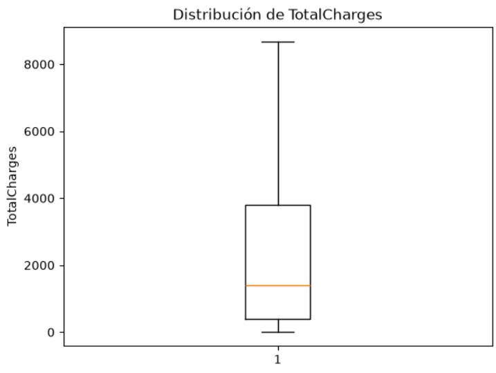

# Customer Churn Prediction

## Informe del Proyecto

### 1. Introducción

La retención de clientes representa uno de los principales desafíos para las empresas que ofrecen servicios por suscripción. Cada cliente que decide abandonar la compañía implica una reducción de ingresos y un incremento en los costos asociados a la captación de nuevos usuarios. Por este motivo, comprender las causas que impulsan el abandono y anticipar qué clientes presentan un mayor riesgo de churn constituye una herramienta estratégica para la toma de decisiones.

El análisis de datos y las técnicas de Machine Learning permiten transformar la información histórica de los clientes en conocimiento útil para el negocio. A partir de variables demográficas, características de los servicios contratados e información de facturación, es posible identificar patrones de comportamiento asociados al abandono y desarrollar modelos predictivos que ayuden a implementar acciones preventivas.

En este proyecto se desarrolló un flujo completo de análisis de datos, comenzando con la comprensión y preparación del conjunto de datos, continuando con un análisis exploratorio orientado a descubrir los factores relacionados con el churn y finalizando con la construcción y comparación de diferentes modelos de Machine Learning para predecir el riesgo de abandono de los clientes.

### 2. Objetivos
#### Objetivo general

Desarrollar un modelo predictivo capaz de identificar clientes con alta probabilidad de abandonar el servicio, utilizando técnicas de análisis de datos y Machine Learning que permitan obtener información útil para apoyar estrategias de retención.

#### Objetivos específicos
- Comprender la estructura y calidad del conjunto de datos.
- Identificar inconsistencias, valores faltantes y oportunidades de mejora mediante un proceso de limpieza y transformación.
- Analizar las variables con mayor relación respecto al abandono de clientes.
- Preparar el conjunto de datos para el entrenamiento de modelos predictivos.
- Entrenar y comparar diferentes algoritmos de clasificación.
- Seleccionar el modelo con mejor desempeño utilizando métricas objetivas.
- Obtener conclusiones e insights que puedan contribuir a la toma de decisiones dentro de la empresa.

### 3. Descripción del Dataset

Para el desarrollo del proyecto se utilizó el conjunto de datos Telco Customer Churn, ampliamente utilizado en problemas de clasificación relacionados con la retención de clientes.

El dataset contiene información correspondiente a 7.043 clientes y 21 variables, las cuales describen características demográficas, servicios contratados, información de facturación y el estado final del cliente respecto al abandono del servicio.

Las variables incluidas en el análisis son las siguientes:

|Atributo	Descripción|
| -------| ----------:|
|customerID|	Identificador único del cliente.|
|gender|	Género del cliente.|
|SeniorCitizen|	Indica si el cliente es adulto mayor.|
|Partner|	Indica si el cliente posee pareja.|
|Dependents|	Indica si el cliente posee dependientes.|
|tenure|	Cantidad de meses que el cliente permanece en la empresa.|
|PhoneService|	Servicio telefónico contratado.|
|MultipleLines|	Cantidad de líneas telefónicas contratadas.|
|InternetService	|Tipo de servicio de Internet contratado.|
|OnlineSecurity	|Servicio de seguridad en línea.|
|OnlineBackup	|Servicio de respaldo en línea.|
|DeviceProtection|	Servicio de protección de dispositivos.|
|TechSupport	|Servicio de soporte técnico.|
|StreamingTV|	Servicio de televisión por streaming.|
|StreamingMovies|	Servicio de películas por streaming.|
|Contract|	Tipo de contrato del cliente.|
|PaperlessBilling|	Facturación electrónica.|
|PaymentMethod|	Método de pago utilizado por el cliente.|
|MonthlyCharges|	Cargo mensual del servicio.|
|TotalCharges|	Cargo total acumulado.|
|Churn|	Variable objetivo que indica si el cliente abandonó la empresa.|

El conjunto de datos combina variables categóricas y numéricas, lo que permite analizar diferentes aspectos del comportamiento de los clientes y desarrollar modelos predictivos capaces de estimar la probabilidad de abandono.

### 4. Metodología

Para el desarrollo del proyecto se siguió una metodología secuencial que permitió transformar los datos originales en información útil para el análisis y la construcción de modelos predictivos.

El proceso completo se estructuró en las siguientes etapas:

- Comprensión del conjunto de datos, identificando la estructura, dimensiones y tipos de variables disponibles.
- Limpieza y transformación de datos, corrigiendo inconsistencias, eliminando registros con valores vacíos y adecuando los tipos de datos para facilitar el análisis.
- Análisis Exploratorio de Datos (EDA), con el objetivo de comprender el comportamiento de las variables y detectar aquellas con mayor relación respecto al abandono de clientes.
- Preparación para Machine Learning, donde se realizaron las transformaciones necesarias para el entrenamiento de modelos, incluyendo codificación de variables categóricas, escalado de variables numéricas y separación entre datos de entrenamiento y prueba.
- Entrenamiento y evaluación de modelos, comparando diferentes algoritmos de clasificación mediante métricas como Accuracy, Precision, Recall, F1-Score y ROC-AUC.
- Visualización de resultados, desarrollando un dashboard interactivo en Power BI para resumir los principales indicadores, hallazgos e insights obtenidos durante el proyecto.

### 5. Limpieza y Preparación de Datos

Antes de realizar el análisis exploratorio y construir los modelos de Machine Learning, fue necesario evaluar la calidad del conjunto de datos y realizar una serie de transformaciones para garantizar la consistencia de la información.

Como primera etapa, se verificó la estructura de cada variable mediante el análisis de valores únicos, tipos de datos y posibles inconsistencias. Este proceso permitió confirmar que las variables categóricas no presentaban errores de escritura ni categorías duplicadas, asegurando la uniformidad de los datos antes de comenzar el análisis.

Posteriormente, se evaluó la presencia de valores faltantes. Aunque el dataset no contenía valores nulos tradicionales (NaN), se identificaron registros con valores vacíos en la variable TotalCharges. Estos registros representaban únicamente el 0,16 % del total del conjunto de datos.

Luego de analizar dichos casos, se observó que todos correspondían a clientes con una antigüedad (tenure) igual a cero meses y que, además, no habían abandonado el servicio. Debido a la baja proporción de estos registros y a que no existía información suficiente para estimar correctamente el cargo total, se decidió eliminarlos del conjunto de datos.

Esta decisión permitió mantener la calidad del dataset sin introducir valores artificiales que pudieran afectar el desempeño de los modelos predictivos.

Además de la eliminación de registros incompletos, se realizaron diversas transformaciones orientadas a mejorar la interpretación de las variables y facilitar el procesamiento posterior.

Entre las principales modificaciones realizadas se encuentran:

- Conversión de variables al tipo de dato más apropiado (category, float e int).
- Reemplazo de la codificación de la variable SeniorCitizen de valores numéricos (0 y 1) a categorías Yes y No, mejorando la coherencia con el resto del dataset.
- Simplificación de categorías como "No internet service" y "No phone service", reemplazándolas por "No", ya que ambas representan la ausencia del servicio correspondiente y no aportan información adicional para el análisis exploratorio.
- Estandarización general de las variables categóricas para mantener un formato homogéneo en todo el conjunto de datos.

Una vez finalizadas estas tareas, se obtuvo un dataset consistente, sin registros incompletos y preparado para las siguientes etapas del proyecto.

Resumen de las transformaciones realizadas: 

|Transformación	Resultado|
| ----------| ----------:|
|Verificación de categorías|	No se encontraron errores de escritura ni categorías duplicadas.|
|Identificación de valores vacíos|	Se detectaron valores vacíos únicamente en TotalCharges.|
|Eliminación de registros|	Se eliminaron los registros con valores vacíos (0,16 % del dataset).|
|Conversión de tipos de datos|	Variables convertidas a category, float e int.|
|Reemplazo de categorías|	Se estandarizaron valores para mejorar la consistencia del dataset.|

#### Conclusión

El proceso de limpieza permitió obtener un conjunto de datos consistente y confiable para las etapas posteriores del proyecto. Las transformaciones realizadas no modificaron de manera significativa la distribución de la información, pero sí mejoraron la calidad del dataset, facilitaron su interpretación y garantizaron que los modelos de Machine Learning trabajaran sobre datos correctamente estructurados.

### 6. Análisis Exploratorio de Datos (EDA)

Una vez finalizado el proceso de limpieza y transformación, se realizó un Análisis Exploratorio de Datos (EDA) con el objetivo de comprender el comportamiento de los clientes e identificar las variables con mayor relación respecto al abandono del servicio.

El análisis se dividió en dos partes. En primer lugar, se estudiaron las variables categóricas mediante gráficos de barras y tablas de frecuencias, comparando la distribución entre clientes que permanecieron en la empresa y aquellos que abandonaron el servicio. Posteriormente, se analizaron las variables numéricas utilizando estadísticos descriptivos y diagramas de caja (Boxplots), permitiendo comparar el comportamiento de ambos grupos.

Este enfoque permitió identificar diferencias significativas entre clientes con y sin churn, facilitando la detección de patrones que posteriormente serían utilizados durante el entrenamiento de los modelos predictivos.

#### Principales hallazgos

El análisis permitió identificar varios factores fuertemente asociados al abandono de clientes.

#### Tipo de contrato

La variable Contract fue una de las más representativas del análisis. Se observó que la gran mayoría de los clientes que abandonaron la empresa poseían contratos Month-to-month, mientras que los contratos de uno y dos años estuvieron asociados a una mayor permanencia.

#### Tipo de servicio de Internet

Los clientes con servicio de Fibra Óptica presentaron una proporción considerablemente mayor de abandono respecto a quienes utilizaban DSL o no poseían servicio de Internet.

#### Soporte técnico y seguridad

Las variables TechSupport y OnlineSecurity mostraron un comportamiento muy similar. Los clientes que no contaban con estos servicios presentaron una probabilidad de abandono significativamente superior.

#### Método de pago

El método de pago también mostró diferencias relevantes. Los clientes que utilizaban Electronic Check registraron una mayor tasa de churn en comparación con el resto de los métodos de pago.

#### Variables numéricas

El análisis de las variables numéricas mostró diferencias claras entre ambos grupos de clientes.

Los clientes que abandonaron la empresa presentaron una antigüedad considerablemente menor (tenure), permaneciendo menos tiempo dentro de la compañía. Además, registraron cargos mensuales más elevados, mientras que el monto acumulado (TotalCharges) resultó inferior debido a su menor permanencia.

Los diagramas de caja confirmaron estas diferencias y permitieron observar la presencia de algunos valores atípicos. Sin embargo, dichos registros fueron considerados representativos del comportamiento real del negocio y, por lo tanto, no fueron eliminados.

##### Tenure

##### Monthly Charges

##### Total Charges

#### Conclusión

El análisis exploratorio permitió identificar que el abandono de clientes no ocurre de manera aleatoria, sino que se encuentra asociado a determinadas características del servicio contratado y al comportamiento de los clientes.

Entre los factores con mayor relación respecto al churn se destacaron el tipo de contrato, el servicio de Internet, la ausencia de soporte técnico, la antigüedad del cliente y los cargos mensuales. Estos resultados proporcionaron una base sólida para la etapa de Machine Learning, donde dichas variables serían utilizadas para construir modelos predictivos.

### 7. Preparación para Machine Learning

Una vez identificado el comportamiento de las principales variables, se preparó el conjunto de datos para el entrenamiento de modelos de clasificación.

El objetivo de esta etapa fue transformar el dataset original en una estructura completamente numérica y compatible con los algoritmos de Machine Learning, conservando la información relevante obtenida durante el análisis exploratorio.

Las principales tareas realizadas fueron las siguientes:

- Se creó una copia independiente del conjunto de datos para preservar el dataset utilizado durante el análisis exploratorio.
- Las variables binarias fueron transformadas a una representación numérica (0 y 1), facilitando su interpretación por parte de los algoritmos.
- Las variables con más de dos categorías (InternetService, Contract, PaymentMethod y MultipleLines) fueron codificadas mediante One-Hot Encoding, evitando introducir relaciones de orden inexistentes entre sus categorías.
- La variable objetivo (Churn) fue separada del resto de las variables predictoras, obteniendo la matriz de características (X) y el vector objetivo (y).
- Posteriormente, el conjunto de datos fue dividido en entrenamiento y prueba mediante la estrategia Train-Test Split, utilizando un 80 % de los registros para entrenar los modelos y el 20 % restante para evaluar su desempeño sobre datos no vistos durante el entrenamiento.
- Finalmente, debido a que la Regresión Logística es un algoritmo sensible a la escala de las variables, se aplicó un proceso de estandarización sobre las variables numéricas mediante StandardScaler. Esta transformación se utilizó únicamente en los modelos que lo requerían, manteniendo una versión del dataset sin escalar para los algoritmos basados en árboles.

#### Resumen de las transformaciones

|Proceso|	Objetivo|
| ----------| ----------:|
|Conversión de variables binarias|	Representación numérica (0 y 1).|
|One-Hot Encoding|	Transformar variables categóricas con múltiples categorías.|
|Separación X / y|	Definir variables predictoras y variable objetivo.|
|Train-Test Split|	Dividir el dataset para entrenamiento y evaluación.|
|StandardScaler|	Escalar variables numéricas para la Regresión Logística.|
#### Conclusión

Al finalizar esta etapa se obtuvo un conjunto de datos completamente preparado para el entrenamiento de modelos predictivos. Las transformaciones realizadas garantizaron que cada algoritmo recibiera la información en el formato adecuado, permitiendo realizar una comparación objetiva entre los diferentes modelos desarrollados durante el proyecto.

### 8. Desarrollo de Modelos

Con el conjunto de datos completamente preparado, se procedió al entrenamiento de diferentes algoritmos de clasificación con el objetivo de predecir si un cliente abandonaría o no el servicio.

Para este proyecto se seleccionaron tres modelos ampliamente utilizados en problemas de clasificación supervisada:

- Regresión Logística
- Árbol de Decisión
- Random Forest

Cada uno de estos algoritmos presenta características diferentes y permite evaluar distintas estrategias de predicción.

La Regresión Logística fue utilizada como modelo base debido a su simplicidad, capacidad de interpretación y buen desempeño en problemas de clasificación binaria. Además, se entrenó tanto con variables escaladas como sin escalar para evaluar el impacto del preprocesamiento.

Posteriormente, se implementó un Árbol de Decisión, capaz de capturar relaciones no lineales entre las variables mediante reglas de decisión simples. Finalmente, se entrenó un modelo de Random Forest, el cual combina múltiples árboles de decisión con el objetivo de reducir el sobreajuste y mejorar la capacidad de generalización.

Todos los modelos fueron evaluados utilizando exactamente el mismo conjunto de entrenamiento y prueba, permitiendo realizar una comparación objetiva de su desempeño.

Para medir la calidad de las predicciones se utilizaron las siguientes métricas:

- Accuracy
- Precision
- Recall
- F1-Score
- ROC-AUC
- Matriz de Confusión

Estas métricas permitieron evaluar no solo la precisión general de cada modelo, sino también su capacidad para identificar correctamente a los clientes con riesgo de abandono.

### 9. Comparación de Modelos

Una vez entrenados los tres algoritmos, se comparó su desempeño utilizando las métricas obtenidas sobre el conjunto de prueba.

|Modelo|	Accuracy|	ROC-AUC|
| ------| -------:|--------:|
|Regresión Logística|	80.38 %	0.8357|
|Random Forest|	78.75 %	0.8119|
|Árbol de Decisión|	71.50 %	0.6382|

La Regresión Logística obtuvo el mejor desempeño general, alcanzando la mayor precisión y el valor más alto de ROC-AUC. Además, presentó un mejor equilibrio entre Precision y Recall, logrando identificar una mayor cantidad de clientes con riesgo de abandono sin incrementar significativamente los falsos positivos.

El modelo de Random Forest obtuvo resultados competitivos y superó ampliamente al Árbol de Decisión. Sin embargo, su capacidad para detectar clientes con churn fue ligeramente inferior a la obtenida por la Regresión Logística.

Por otro lado, el Árbol de Decisión presentó el desempeño más bajo entre los tres modelos. Aunque permite interpretar fácilmente las reglas de decisión, mostró una menor capacidad de generalización y un rendimiento considerablemente inferior en las métricas evaluadas.

Considerando los resultados obtenidos, la Regresión Logística fue seleccionada como el modelo final del proyecto por ofrecer el mejor equilibrio entre desempeño predictivo e interpretabilidad.

| Métrica           | Logistic Regression (Scaled) | Decision Tree | Random Forest |
| ----------------- | ---------------------------: | ------------: | ------------: |
| Accuracy          |                   **0.8038** |        0.7150 |        0.7875 |
| Precision (Churn) |                     **0.65** |          0.46 |          0.63 |
| Recall (Churn)    |                     **0.57** |          0.48 |          0.50 |
| F1-score (Churn)  |                     **0.61** |          0.47 |          0.56 |
| ROC-AUC           |                   **0.8357** |        0.6382 |        0.8119 |

### 10. Dashboard en Power BI

Como complemento al análisis realizado en Python, se desarrolló un dashboard interactivo utilizando Power BI con el objetivo de resumir visualmente los principales indicadores del proyecto y facilitar la interpretación de los resultados.

El dashboard fue diseñado con un enfoque orientado al negocio, permitiendo explorar las variables más relevantes asociadas al abandono de clientes mediante indicadores, gráficos y visualizaciones interactivas.

Entre los principales elementos incluidos se encuentran:

- Indicadores generales del conjunto de datos.
- Distribución de clientes con y sin churn.
- Análisis por tipo de contrato.
- Análisis de los servicios contratados.
- Distribución por métodos de pago.
- Comparación de variables numéricas.
- Principales factores asociados al abandono.

La integración del dashboard permite transformar los resultados obtenidos durante el análisis exploratorio y el desarrollo de modelos en información fácilmente interpretable para usuarios de negocio, facilitando la toma de decisiones basada en datos.

##### (captura general del Dashboard.)

##### (dashboard posee varias páginas.)

### 11. Conclusiones

El desarrollo de este proyecto permitió recorrer todas las etapas de un flujo completo de análisis de datos y Machine Learning, comenzando con la comprensión del conjunto de datos y finalizando con la construcción de un modelo predictivo capaz de estimar el riesgo de abandono de clientes.

El análisis exploratorio permitió identificar que variables como el tipo de contrato, la antigüedad del cliente, el tipo de servicio de Internet, el soporte técnico y los cargos mensuales presentan una fuerte relación con el churn, aportando información valiosa para comprender el comportamiento de los clientes.

En la etapa de modelado se compararon tres algoritmos de clasificación diferentes. La Regresión Logística obtuvo el mejor desempeño general, alcanzando un Accuracy de 80.38 % y un ROC-AUC de 0.8357, posicionándose como la alternativa más adecuada para este conjunto de datos debido a su equilibrio entre capacidad predictiva e interpretabilidad.

Finalmente, el desarrollo del dashboard en Power BI permitió resumir de forma visual los principales resultados obtenidos durante el análisis, facilitando la interpretación de la información y proporcionando una herramienta útil para apoyar estrategias de retención de clientes.

En conjunto, este proyecto demuestra cómo la combinación de técnicas de análisis exploratorio, preparación de datos y Machine Learning puede contribuir a identificar clientes con mayor probabilidad de abandono, proporcionando información relevante para la toma de decisiones dentro de una organización.